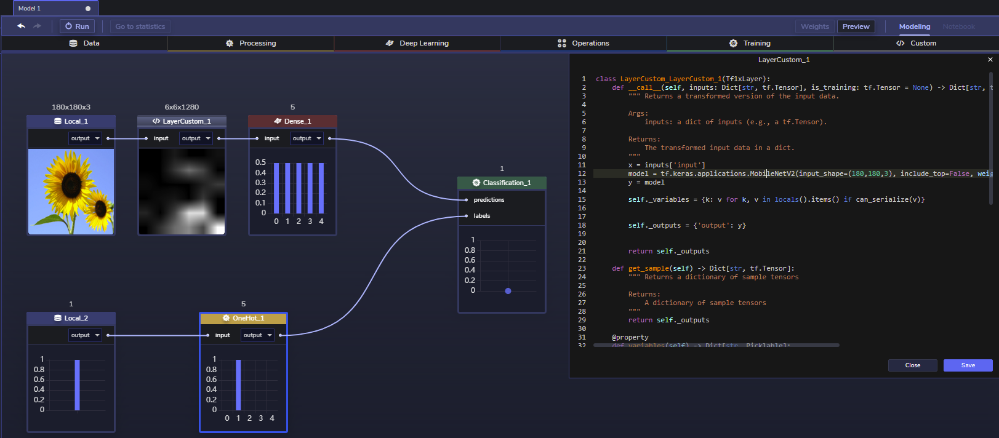

[](https://www.perceptilabs.com/home)

# Overview
*Transfer learning* is a method for leveraging existing trained models as a starting point to solve similar problems, and thus get to an initial working model quicker. 

However, when working in raw code, it can be difficult to understand an existing model's architecture and how much of the base is being frozen. And there are no visualizations to gain insight into how the data is transformed or what sort of predictions are being generated. 

# Transfer Learning With Keras Applications in PerceptiLabs

We've provided this GitHub repo to show how easy it is to do transfer learning in PerceptiLabs. By using PerceptiLabs, you gain the ability to split the base and label training, and can visualize the transformed data and predictions.

**Note**: This model is not compatible with PerceptiLabs 0.12 as the UI and components have changed.

In the included model, we show how a [Custom component](https://www.perceptilabs.com/docs/components) invokes [tf.keras.applications.MobileNetV2()](https://keras.io/api/applications/mobilenet/#mobilenetv2-function) to get a pre-trained MobileNet v2 model, loaded with ImageNet weights. We then feed images of flowers into this model to classify them. The following screenshot shows this model in PerceptiLabs:



The base is frozen (because ImageNet weights are being used) while the classifier is replaced (via a new Dense component) and fed with new label data corresponding to the flower images which are first one-hot encoded to remove label ordinality.

The following code from the model's Custom component (LayerCustom_1) shows how Keras' MobileNetV2 is used with ```imagenet``` weights.

```python
class LayerCustom_LayerCustom_1(Tf1xLayer):
    def __call__(self, inputs: Dict[str, tf.Tensor], is_training: tf.Tensor = None) -> Dict[str, tf.Tensor]:
        """ Returns a transformed version of the input data.

        Args:
            inputs: a dict of inputs (e.g., a tf.Tensor).

        Returns:
            The transformed input data in a dict.
        """
        x = inputs['input']
        model = tf.keras.applications.MobileNetV2(input_shape=(180,180,3), include_top=False, weights='imagenet')(x)
        y = model

        self._variables = {k: v for k, v in locals().items() if can_serialize(v)}    

            
        self._outputs = {'output': y}
                

        return self._outputs
```

Happy hacking!

# Dataset
The dataset is hosted publicly on Google Drive and can be downloaded [here](https://drive.google.com/drive/folders/1CZz8gVHhAOA1ElMWRChUMBgFT2nqq_ed) (680 MB).

The dataset consists of two [NumPy](https://numpy.org/) files:
* **images.npy**: contains images of flowers.
* **labels.npy**: contains labels corresponding to the flower images.

Note that the underlying image data originated from [TensorFlow's Image Classification Tutorial](https://www.tensorflow.org/tutorials/images/classification). The direct link to the image data is [here](https://storage.googleapis.com/download.tensorflow.org/example_images/flower_photos.tgz).

# Structure
This repo has the following structure:
* **/model.json**: contains the PerceptiLabs model file for use in PerceptiLabs v0.11.

# Installation

Follow the steps below to load and prepare the sample model in PerceptiLabs:

1. Clone or download the sample model from GitHub.
2. Download the data files from [here](https://drive.google.com/drive/folders/1CZz8gVHhAOA1ElMWRChUMBgFT2nqq_ed).
2. On the ModelHub screen in PerceptiLabs, import the sample model into PerceptiLabs. Note that this model is not compatible with PerceptiLabs 0.12 as the UI and components have changed. When prompted for the model's directory, navigate to and select the location of the **model.json** file.
4. Open the topmost **Data** component in the model workspace and set its file to **images.npy**.
Open the second **Data** component in the model workspace and set its file to **labels.npy**.

The model can now be trained.

# Community

Got questions, feedback, or want to join a community of machine learning practitioners working with exciting tools and projects? Check out our [Community page](https://www.perceptilabs.com/community)!
